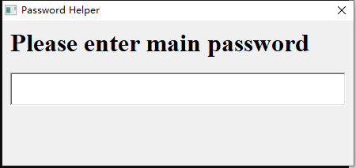
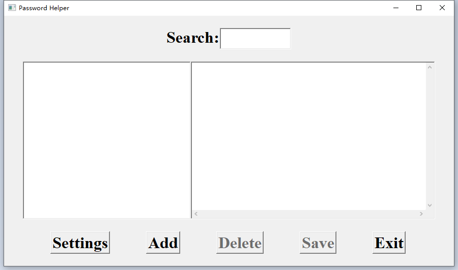
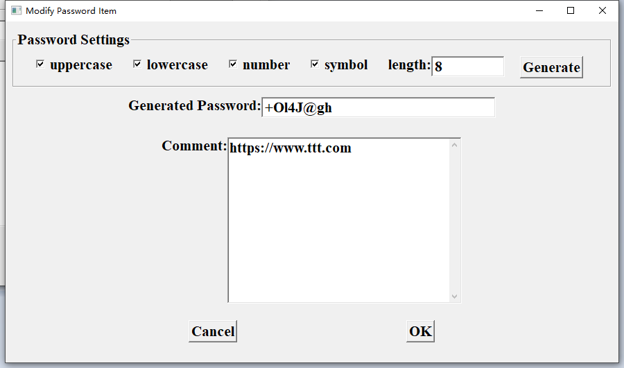

# vpd
A vlang password manager

# Install
A windows binary prebuild is provided under [bin](./bin) directory, just download it and run.


# Usage
1. When program start, you will be asked for the main password.

2. Then you will see the main window.

3. You can click the 'Add' button, add a password item.

4. Please remember save your password file.
5. Next time, you can highlight an item, the password will be copied to the clipboard.
6. Then you can paste the copied password into your website password field.

Tips: Double click an item, you can edit it.

# Build from source
Goto [src](./src) directy, execute 
```bash
 v . -o passwd
```

Also, you can build it under Windows/Linux /X86_64/ARM.

Please note, you must install [v](https://github.com/vlang/v) and install [viup](https://github.com/kbkpbot/viup), [cbsl](https://github.com/kbkpbot/cbsl).